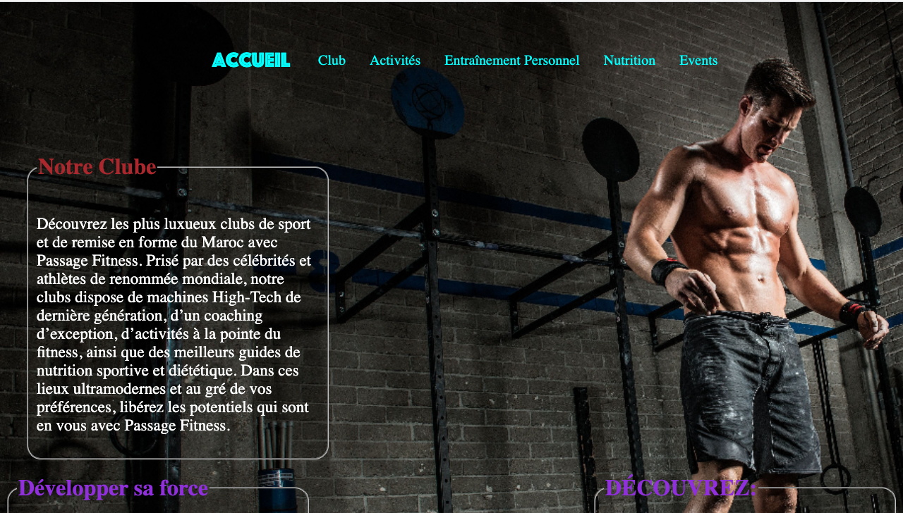
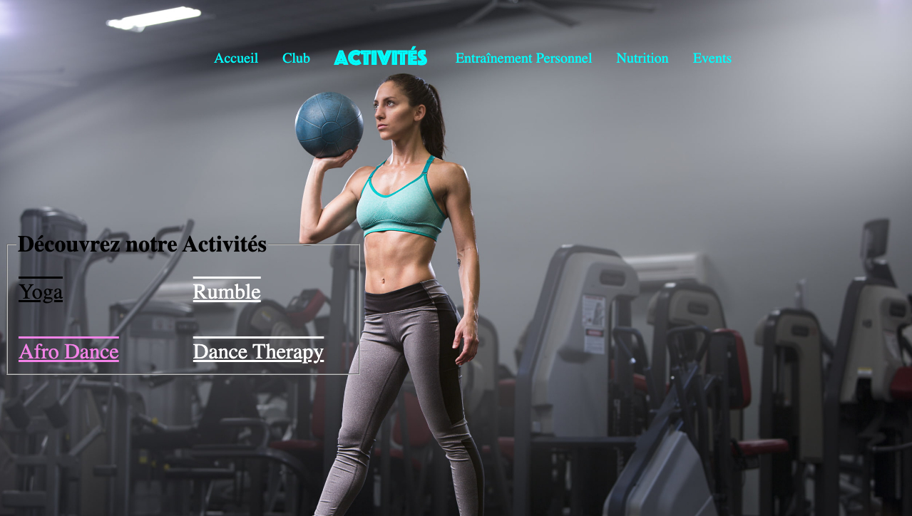
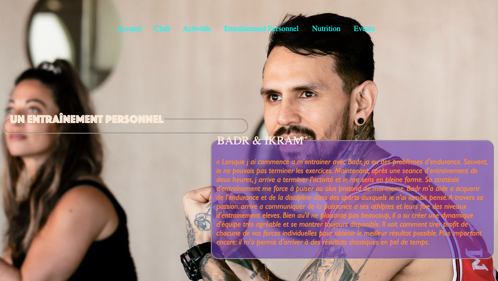
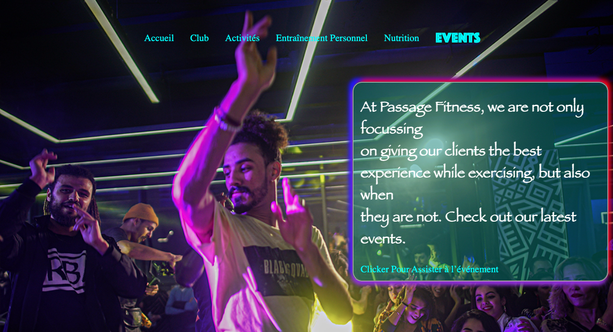

# Gym and Fitness Club Website

A responsive website for gym and fitness clubs to showcase their services and facilities to potential members. 

## Features 
- [x] Display of gym services and facilities 
- [x] Contact form for inquiries 
- [x] Responsive design for desktop 
- [ ] tablet and mobile devices 
- [ ] pricing plans 
- [ ] Online membership registration 

## Screenshots 

### Homepage 



### Activitys 



### Coach 



### Nutrition 


### Events 



## Getting Started 

These instructions will get you a copy of the project up and running on your local machine for development and testing purposes. 


### Installing 

. Clone the repository: 
``` git clone https://github.com/Abdelilah-Falih/Gym_and_Fitness_Club_website.git ```

## Built With 

- [HTML](https://developer.mozilla.org/en-US/docs/Web/HTML)
- [CSS](https://developer.mozilla.org/en-US/docs/Web/CSS)
- [JavaScript](https://developer.mozilla.org/en-US/docs/Web/JavaScript)

## Contributing 

1. Fork the repository 
2. Create your feature branch (`git checkout -b feature/fooBar`) 
3. Commit your changes (`git commit -am 'Add some fooBar'`) 
4. Push to the branch (`git push origin feature/fooBar`) 
5. Create a new Pull Request 

## Author 

- [:link:](https://github.com/Abdelilah-Falih) <ins>Abdelilah Falih.</ins>
